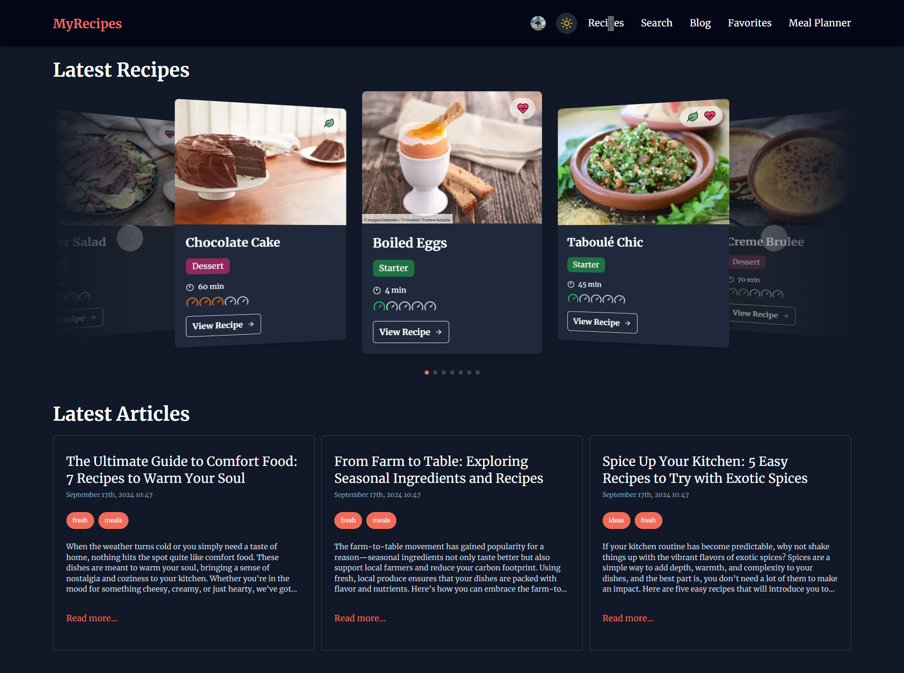
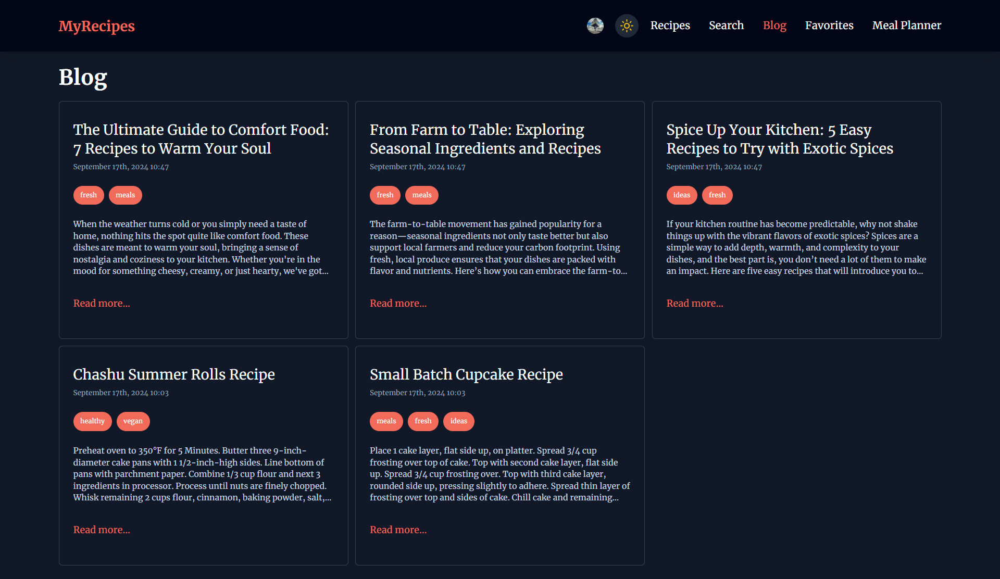
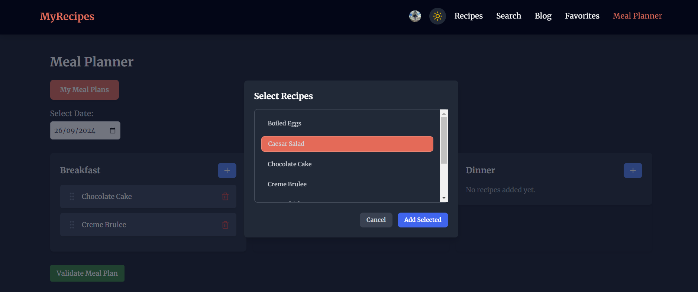

# Recipe App Specifications (Next.js)

## Technologies Used
- **Framework**: Next.js
- **Database**: MongoDB with Prisma ORM
- **Authentication**: Clerk (for user registration, login, and account management)
- **UI Libraries**: SwiperJS (for sliders), Chart.js (for graphs)
- **Additional Features**: Dark/Light Mode support, Recipe PDF download, API for nutritional information

---







## Core Functionalities

### 1. User Authentication & Account Management
- **Authentication Provider**: Clerk for user authentication and account management.
  - **Registration/Login**: Users can register or log in using Clerk’s authentication system.
  - **Account Management**: Users can manage their profiles via Clerk's interface.

### 2. Recipe Management
- **Recipe Listing**:
  - Recipes are displayed in a visually appealing manner using **SwiperJS** for sliders.
  - Users can browse recipes categorized by main course, dessert, starter, etc.
  
- **Recipe Details**:
  - For each recipe, the following information is available:
    - **Name**: The title of the recipe.
    - **Preparation Time**: Time required to prepare the recipe.
    - **Difficulty Level**: A difficulty rating (e.g., easy, medium, hard).
    - **Type**: Classification of the recipe (e.g., main course, dessert, starter).
    - **Photo**: Image of the recipe.
    - **Instructions & Steps**: 
      - Instructions for preparation.
      - Each step of the recipe is presented in a slider (using **SwiperJS**) to facilitate step-by-step cooking.
    - **Ingredients & Tools**: Complete list of ingredients and tools required for the recipe.
    - **Nutritional Information**: 
      - Data fetched via an external API (e.g., calories, fat, protein, etc.).
      - **Macronutrients Graph**: Displayed using **Chart.js** to visualize macronutrient breakdown (e.g., carbs, protein, fat).
    - **Comments & Suggestions**: 
      - Users can leave comments on recipes.
      - Suggestions for similar recipes (based on the same category) are provided.
    - **Sharing**: Users can share recipes on **Facebook** and **Instagram**.
    - **Download**: Users can download the recipe in PDF format.
    - **Favorite Recipes**: Logged-in users can add recipes to their favorites for quick access.

### 3. Recipe Search
- **Search Functionality**:
  - Users can search recipes by title only.
  - Search becomes operational after the user types a minimum of 3 characters.
  - No additional filtering criteria are available beyond the recipe title.

### 4. Blog Management
- **Article Display**:
  - The blog section contains articles written by various authors.
  - Each article includes:
    - **Tags**: For categorization or topics discussed.
    - **Date**: The published date of the article.
    - **Author**: The author who wrote the article.
    - **Comments**: Readers can leave comments on each article.
    - **Content**: The main content of the article.

### 5. Meal Planner
- **Meal Plan Creation**:
  - Users can select recipes for different meal types (breakfast, lunch, dinner) for specific dates.
  - Users can assign recipes to each meal time for future dates.
  
- **Meal Plan Display**:
  - Users can view all their meal plans in a calendar-style or list view.
  - The meal plans display all selected meals for each day.
  
- **Meal Plan Management**:
  - Users can delete individual meal plans if no longer needed.

---

## Additional Features
- **Dark/Light Mode**: 
  - The app supports toggling between dark and light modes for enhanced user experience and accessibility.

---

## Third-Party Integrations
- **Social Media**: Recipes can be shared on Facebook and Instagram.
- **Nutritional Information API**: Used to fetch nutritional data for recipes.
- **PDF Generation**: Allows users to download recipes in PDF format.


This is a [Next.js](https://nextjs.org) project bootstrapped with [`create-next-app`](https://nextjs.org/docs/app/api-reference/cli/create-next-app).

## Getting Started

First, run the development server:

```bash
npm run dev
# or
yarn dev
# or
pnpm dev
# or
bun dev
```

Open [http://localhost:3000](http://localhost:3000) with your browser to see the result.

You can start editing the page by modifying `app/page.tsx`. The page auto-updates as you edit the file.

This project uses [`next/font`](https://nextjs.org/docs/app/building-your-application/optimizing/fonts) to automatically optimize and load [Geist](https://vercel.com/font), a new font family for Vercel.

## Learn More

To learn more about Next.js, take a look at the following resources:

- [Next.js Documentation](https://nextjs.org/docs) - learn about Next.js features and API.
- [Learn Next.js](https://nextjs.org/learn) - an interactive Next.js tutorial.

You can check out [the Next.js GitHub repository](https://github.com/vercel/next.js) - your feedback and contributions are welcome!

## Deploy on Vercel

The easiest way to deploy your Next.js app is to use the [Vercel Platform](https://vercel.com/new?utm_medium=default-template&filter=next.js&utm_source=create-next-app&utm_campaign=create-next-app-readme) from the creators of Next.js.

Check out our [Next.js deployment documentation](https://nextjs.org/docs/app/building-your-application/deploying) for more details.
